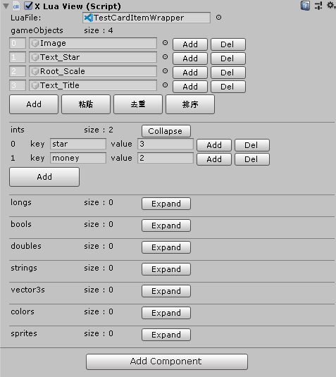
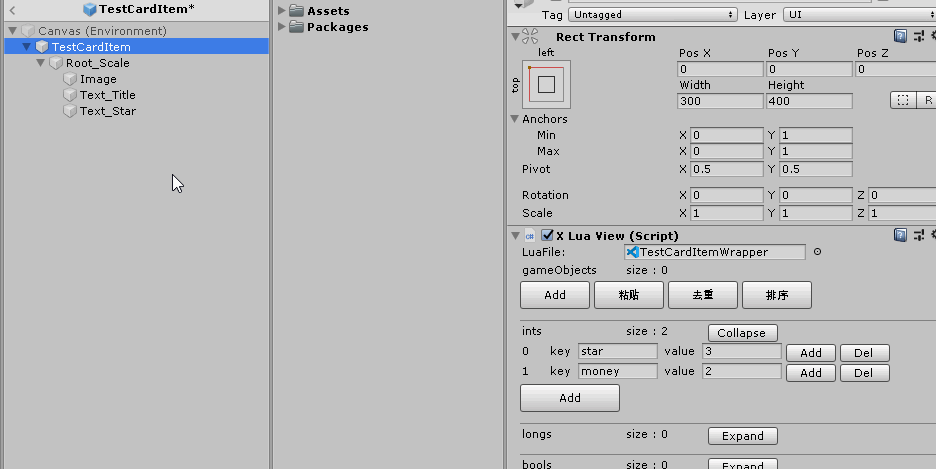
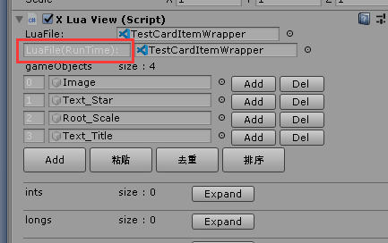
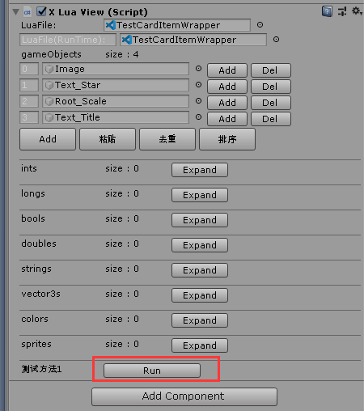
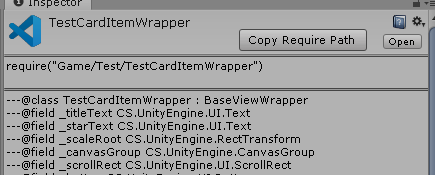
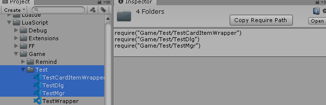
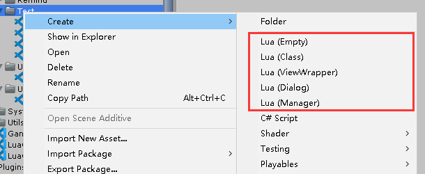
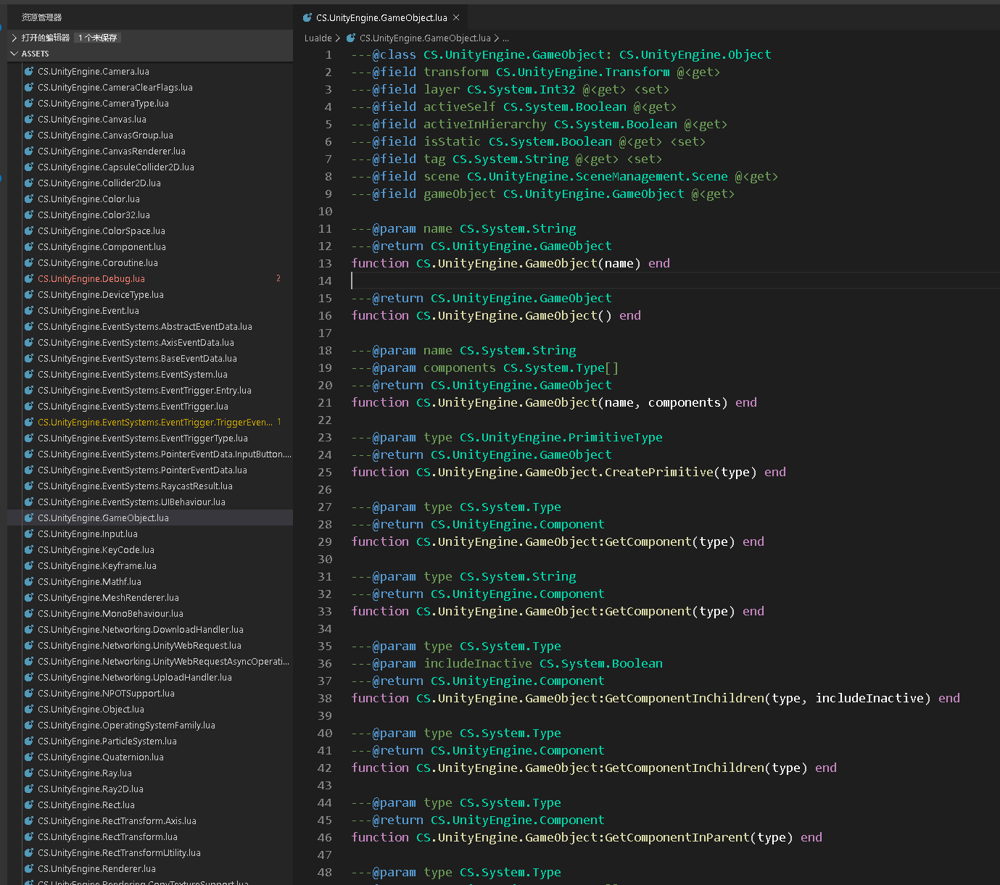
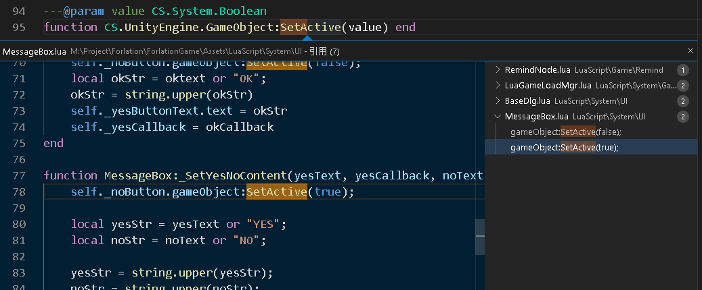

# Forlation

Forlation是一个基于Unity/xLua设计的简易游戏框架，旨在提供高度契合[EmmyLua](https://emmylua.github.io/annotation.html)的面向对象设计以及良好的编码体验，目前正在持续施工中。

~~如果您精通Chinglish，您可以发现Forlation正是为了(For)类型(Lation)的意思，~~
在复杂的项目中，带类型的语言设计可以避免诸多痛苦的问题，然而相比隔壁(js/ts)的发展，lua的周边开发配套并不能令人满意，

**在您考虑使用脚本语言编写您的游戏时，极力推荐您使用[Puerts](https://github.com/Tencent/puerts)/[TypeScript](https://www.typescriptlang.org/docs/)而不是各类Lua框架**


## 特性速览：

### 类的声明和实例创建
如果您受够了网络上各种诸如
```lua
---@class Cat
function Cat:New()
    local o = {}
    -- 这里的self指代Cat类本身而非其实例，可能会令新手疑惑
    setmetatable(o, self)
    -- 每New一次就需要给Cat重新设置一次__index，这是多余的
    self.__index = self
    return o
end

---@type Cat
local oneCat = Cat:New()
```

的写法，您可以考虑以下写法

```lua
-- 声明Animal类
---@class Animal : XObject
Animal = DefineClass(Animal)

function Animal:Eat()
    print("animal eat")
end

-- 声明Cat类（作为Animal的派生类）
---@class Cat : Animal
Cat = DefineInheritedClass(Cat, Animal)

function Cat:Eat()
    print("cat eat")

    -- 保守的调用基类方法写法
    Animal.Eat(self);
    -- *实验性质的调用基类方法写法
    self:ToBase(Animal):Eat()
end

-- 创建一个Cat类的实例
-- local oneCat = CreateClassInstance(Cat)
-- CCC是CreateClassInstance的别名，为了便于使用
local oneCat = CCC(Cat)

-- 这种方式创建出的实例，EmmyLua插件能自动识别出其类型
```

### 注重使用体验的XLuaView面板组件
如果您曾使用过XLua，您可能会对其提供的LuaBehaviour组件印象深刻，而这里对LuaBehaviour进行了深度魔改:



您可以方便地删除或者插入指定位置的元素，除此之外，

您可以通过右键菜单或者Ctrl+E，方便的将多个选中的场景内物体，加入到面板上:




Lua层面提供了BaseViewWrapper类与XLuaView组件相配套，您可以在运行时观察到当前XLuaView组件绑定了哪个派生自BaseViewWrapper的脚本:



您也可以在lua中注册测试方法，然后在运行时的XLuaView组件面板上点击调用它
```lua
---@class TestCardItemWrapper : BaseViewWrapper
TestCardItemWrapper = DefineInheritedClass(TestCardItemWrapper, BaseViewWrapper)
function TestCardItemWrapper:_OnInit()
    self:_AddTestFunc("测试方法1", function() 
        print("测试方法1")
    end)
end
```



### 可轻易获取的Lua Require Path

使用lua的过程中，不可避免地需要在很多地方使用require函数，为此，该框架内重写了lua文件的Inspector类：



当然，您也可以一次性选中多个文件：



### 配套的从Lua模板创建Lua文件

大脑的记忆区域不该被重复的代码片段所占用



### EmmyLua Api注解（不支持泛型 呜呜）
您可以通过菜单"XLua-导出EmmyLua Api注解"生成C#API对应的Lua注解，无论是使用IntelliJ还是VsCode，安装完对应的EmmyLua插件，无须额外第三方库支持就能识别并使用



您甚至可以很方便地知道这些C#的Api在何处被调用：



(VsCode推荐EmmyLua插件：[luaide-lite **v0.2.0版本**](https://marketplace.visualstudio.com/items?itemName=wellshsu.luaide-lite#review-details)、[EmmyLua](https://marketplace.visualstudio.com/items?itemName=tangzx.emmylua#review-details)、[Lua Language Server](https://marketplace.visualstudio.com/items?itemName=sumneko.lua#review-details))